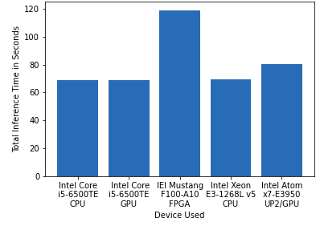
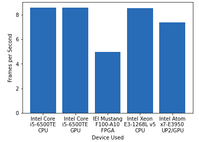
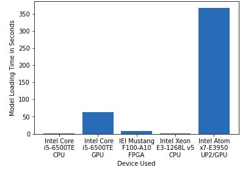
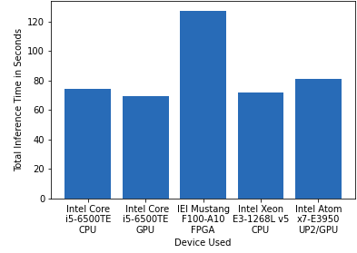
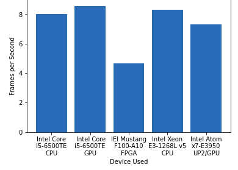
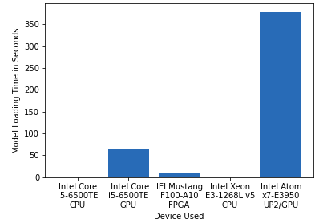
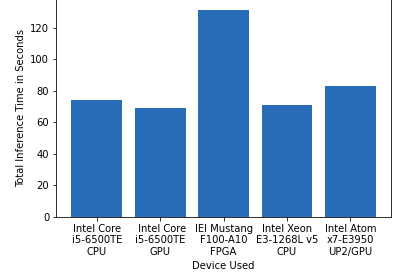
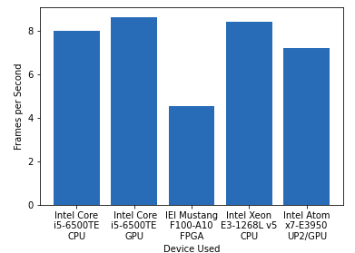
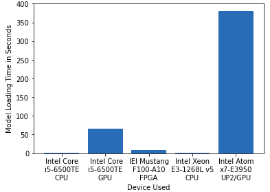

# Computer Pointer Controller

The project tracks the gaze of an individual person in an image and moves the mouse to follow the direction of their gaze
The project makes use of multiple models:
https://docs.openvinotoolkit.org/latest/omz_models_intel_face_detection_adas_0001_description_face_detection_adas_0001.html
https://docs.openvinotoolkit.org/latest/omz_models_intel_head_pose_estimation_adas_0001_description_head_pose_estimation_adas_0001.html
https://docs.openvinotoolkit.org/latest/omz_models_intel_landmarks_regression_retail_0009_description_landmarks_regression_retail_0009.html
https://docs.openvinotoolkit.org/latest/omz_models_intel_gaze_estimation_adas_0002_description_gaze_estimation_adas_0002.html

The project takes an image and extract the face region by the face detection model which is then used 
by the head post estimation and facial landmark detection model to gather the pose and the left and right eye 
which is then fed into the gaze estimation model to estimate the location of gaze

## Project Set Up and Installation
You will need to first initialize the open vino environment variable via
{youropenvinoinstalllocation}\bin\setup.{bat/sh}

Then download the models
python {youropenvinoinstalllocation}/deployment_tools/tools/model_downloader/downloader.py --name "face-detection-adas-binary-0001"
python {youropenvinoinstalllocation}/deployment_tools/tools/model_downloader/downloader.py --name "landmarks-regression-retail-0009"
python {youropenvinoinstalllocation}/deployment_tools/tools/model_downloader/downloader.py --name "head-pose-estimation-adas-0001"
python {youropenvinoinstalllocation}/deployment_tools/tools/model_downloader/downloader.py --name "gaze-estimation-adas-0002"

## Demo
python run_inference.py -fd <Path of xml file of face detection model> \
-fl <Path of xml file of facial landmarks detection model> \
-hp <Path of xml file of head pose estimation model> \
-ge <Path of xml file of gaze estimation model> \
-i <Path of input video file or enter cam for taking input video from webcam> 

You may add -d GPU at the end to use GPU or other flags for multi or hetero ie -d HETERO:FPGA,CPU

## Documentation
This code makes use of python mixin to reduce duplicated code. You will find most of the code for 
loading, checking plugins, preprocessing input and prediction in side of model.py where as the different models inheriting 
model.py will implement their own post processing to shape the output for the next model.

fd is required which specify model location for Face Detection model  
fl is required which specify model location for Facial Landmark Detection model  
hp is required which specify model location for  Head Pose Estimation model  
ge is required which Specify Specify model location for Gaze Estimation model  
i is required which specify Path to video file or enter cam for webcam  
flags is not required which Specify the flags from fd, fl, hp, ge like --flags fd hp fl (Seperate each flag by space) to see the visualization of different model outputs of each frame, fd for Face Detection, fl for Facial Landmark Detection hp for Head Pose Estimation, ge for Gaze Estimation.  
l is not required which specify MKLDNN (CPU)-targeted custom layers. Absolute path to a shared library with the kernels impl.") 
prob is not required which specify probability threshold for model to detect the face accurately from the video frame. 
d is not required which specify the target device to infer on:  
   CPU, GPU, FPGA or MYRIAD is acceptable. Sample  
   will look for a suitable plugin for device  
   specified (CPU by default) 
ms is not required which specify speed of mouse movement (fast, medium, slow)

## Benchmarks

### FP32

**Inference Time**   

**Frames per Second**   

**Model Loading Time**   

### FP16

**Inference Time**   

**Frames per Second**   

**Model Loading Time**   

### INT8
**Inference Time**   

**Frames per Second**   

**Model Loading Time**   

## Results
I have run the model in 5 diffrent hardware:-
1. Intel Core i5-6500TE CPU 
2. Intel Core i5-6500TE GPU 
3. IEI Mustang F100-A10 FPGA 
4. Intel Xeon E3-1268L v5 CPU 
5. Intel Atom x7-E3950 UP2 GPU

Compared performances by inference time, frame per second and model loading time.

FPGA required more time for inference as it needed to reprogram the streams for each of the computer vision tasks.
GPU procceses more frames per second especially when using FP16 as it has multiple core and instruction optimized to run 16bit floating point operations

Running models with different precision may reduce size by reducing the precision from FP32 to FP16 or INT8 allowing for faster inference. This however lowers precision as information have been lost from the loss of information from truncation.
## Stand Out Suggestions
1. Have tried FP16 and with safty checks around face detection and facial landmark detection this worked fine little to no drop in performance
2. Have added the preview flags via -flags hp fld ge respectively
3. Have added flag for input to support video and camera feed

### Async Inference
I have added async support for the head pose estimation and facial landmark detection models. I have noticed that head pose inference is most of the time same speed as facial landmark but there are instances where facial landmark 
have finished faster. I then run the head pose estimation and facial landmark asynchronously which gives performance increase of 0.01 frames per second. I would like to make the mouse control work in it's own thread at some later date.

### Edge Cases
This is a simple application set to work with one person's gaze. Of course given the relative settings that may occlude the face or eyes 
and potential lighting and shadows I have added some code to check if a face and both eyes are present. If no either are missing then the program 
will simply return no coordinates and for the the X and Y which will stop the mouse from moving during that iteration and not cause a crash.
